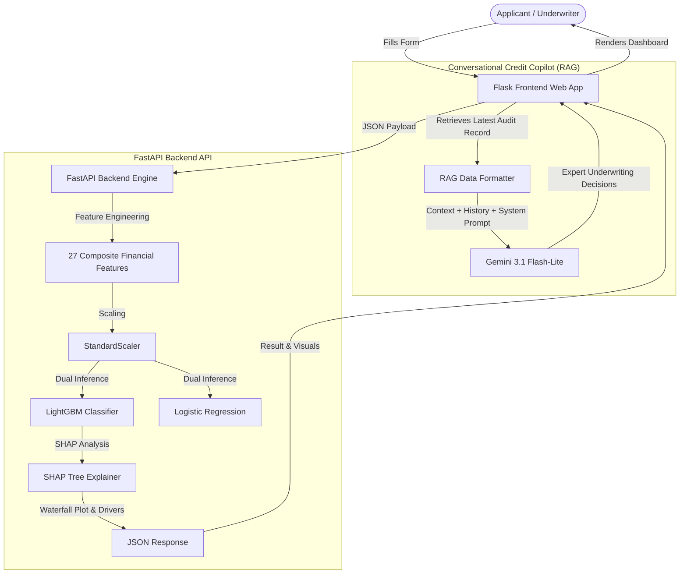

# LOAN XAI SYSTEM: Automated Explainable AI Credit Risk Suite

[](https://depi-loan-default-xai-frontend.onrender.com)
[](https://fastapi.tiangolo.com/)
[](https://flask.palletsprojects.com/)
[](https://deepmind.google/technologies/gemini/)

LOAN XAI SYSTEM is a production-grade, state-of-the-art **Explainable AI (XAI)** loan underwriting and decision-support application. It bridges the gap between complex black-box machine learning models and non-technical banking underwriters by delivering real-time predictions, visual feature-attribution explanations (SHAP), and an interactive credit copilot chatbot.

---

## 🏗️ System Architecture

The application is built on a stateless, decoupled multi-service architecture:



---

## 🌟 Key Features

1. **Stateless Multi-Service Architecture:**
   - **Backend API (FastAPI):** High-speed server managing data transformations, model inference, and SHAP calculations completely in-memory.
   - **Frontend Web (Flask):** Dark-themed, responsive web application that maps user forms to API payloads and displays visual risk dashboards.
2. **Dual-Model Inference:**
   - **LightGBM Classifier:** State-of-the-art tree-based classifier with detailed, feature-level SHAP impact visualizations.
   - **Logistic Regression Pipeline:** Linear baseline model containing internally pre-packaged feature scaling.
3. **Advanced Feature Engineering:** Automatically computes 27 interaction and composite financial stress indicators (e.g. Debt Burden, Risk Score, Payment-to-Income) on-the-fly to match the models' expected 36-dimensional feature space.
4. **Human-Readable XAI Explanations:** Binds raw, unscaled user inputs (e.g. `Income = $55,000` rather than standardized Z-scores) directly to the SHAP waterfall axis, making feature impact plots intuitive for non-technical credit underwriters.
5. **RAG Credit Copilot Chatbot:** An in-app interactive chatbot powered by **Gemini 3.1 Flash-Lite** that automatically retrieves the applicant's latest audit record (Retrieval-Augmented Generation) and provides formal, data-driven underwriting explanations in English or Arabic.

---

## 📂 Directory Structure

```text
loan-default-xai/
├── backend_api/
│   ├── app/
│   │   ├── __init__.py
│   │   ├── main.py          # FastAPI entry point, lifespan loader, predict routes
│   │   ├── schemas.py       # Pydantic v2 validation models
│   │   └── xai_engine.py    # Preprocessing, scaling, inference, & SHAP engine
│   ├── artifacts/
│   │   ├── feature_names.pkl                 # Exact 36 feature names list
│   │   ├── scaler.pkl                        # Fitted StandardScaler object
│   │   ├── lightgbm_model (1).joblib       # LightGBM classifier
│   │   └── logistic_regression_pipeline.joblib # Baseline pipeline (scaler + classifier)
│   ├── requirements.txt     # Backend python dependencies
│   └── test_inference.py    # Automated integration test script
└── frontend_web/
    ├── app.py               # Flask application and route controller
    ├── templates/
    │   ├── index.html       # Clean multi-section application form (Tailwind CSS)
    │   └── dashboard.html   # Risk assessment and SHAP waterfall dashboard
    └── requirements.txt     # Frontend python dependencies
```

---

## ⚙️ Mathematical Feature Engineering Reference

The system automatically transforms raw applicant inputs into the 36 features expected by the models:

*   **Binary Columns:** Maps `Yes`/`No` strings to `1`/`0`.
*   **Education:** Maps `High School` to `0`, `Bachelor's` to `1`, `Master's` to `2`, and `PhD` to `3`.
*   **One-Hot Categoricals:** Categoricals (`employmenttype`, `maritalstatus`, `loanpurpose`) are one-hot encoded with reference classes dropped (`employmenttype_Full-time`, `maritalstatus_Divorced`, `loanpurpose_Auto`).
*   **Log Scales:**
    $$\text{log\_income} = \ln(\text{income} + 1)$$
    $$\text{log\_loanamount} = \ln(\text{loanamount} + 1)$$
*   **Ratios & Affordability Indicators:**
    $$\text{loan\_to\_income} = \frac{\text{loanamount}}{\text{income} + 1}$$
    $$\text{monthly\_income} = \frac{\text{income}}{12}$$
    $$\text{employment\_ratio} = \frac{\text{monthsemployed}}{\text{age} \times 12 + 1}$$
    $$\text{monthly\_payment\_est} = \frac{\text{loanamount} \times \text{interestrate} / 100}{\text{loanterm} + 1}$$
    $$\text{payment\_to\_income} = \frac{\text{monthly\_payment\_est}}{\text{monthly\_income} + 1}$$
    $$\text{debt\_burden\_score} = \text{dtiratio} \times \text{interestrate}$$
    $$\text{log\_loan\_to\_income} = \text{log\_loanamount} - \text{log\_income}$$
*   **Interaction & Flags:**
    $$\text{age\_employment\_interaction} = \text{age} \times \text{monthsemployed}$$
    $$\text{high\_risk\_flag} = 1 \text{ if } (\text{dtiratio} > 0.45 \text{ and } \text{creditscore} < 600) \text{ else } 0$$
    $$\text{is\_very\_high\_risk} = 1 \text{ if } (\text{creditscore} < 580 \text{ and } \text{dtiratio} > 0.40 \text{ and } \text{interestrate} > 15) \text{ else } 0$$
*   **Risk Score (Weighted Indicator):**
    $$\text{cs\_norm} = \frac{\text{creditscore} - 300}{550}$$
    $$\text{rate\_norm} = \frac{\text{interestrate}}{30}$$
    $$\text{risk\_score} = 0.40 \times (1 - \text{cs\_norm}) + 0.35 \times \text{dtiratio} + 0.25 \times \text{rate\_norm}$$

---

## 🚀 Local Development Setup

Ensure you have **Python 3.10+** installed.

### Step 1: Install Dependencies
Open a terminal in the root directory and install dependencies for both the backend and frontend:

```bash
# Install backend dependencies
pip install -r backend_api/requirements.txt

# Install frontend dependencies
pip install -r frontend_web/requirements.txt
```

### Step 2: Run Automated Tests
Execute the integration test script to verify that unpickling, preprocessing, and SHAP visualizations compile correctly:
```bash
python backend_api/test_inference.py
```

### Step 3: Run the Application
Start both servers in separate terminal sessions.

#### Configuration (API Key):
Create a file named `.env` in the root folder of the project (this file is already gitignored) and add your key:
```env
GEMINI_API_KEY="your_gemini_api_key_here"
```

**Terminal 1 (Backend FastAPI):**
```bash
python -m uvicorn backend_api.app.main:app --host 127.0.0.1 --port 8000 --reload
```
The interactive Swagger API documentation will be available at `http://127.0.0.1:8000/docs`.

**Terminal 2 (Frontend Flask):**
```bash
python frontend_web/app.py
```
Open your browser and navigate to `http://127.0.0.1:5000` to access the underwriting application.
